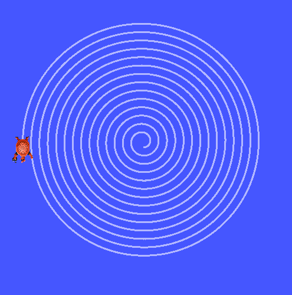

# Archimedean Spiral ROS 2

Aplikasi ROS2 yang menggunakan turtlesim untuk menggambar pola [spiral archimedean](https://en.wikipedia.org/wiki/Archimedean_spiral).


## Prasyarat

- ROS2 (Diuji pada Humble)
- Paket turtlesim
- C++ Compiler

## Instalasi

1. Buat workspace ROS2:
```bash
mkdir -p ~/ros2_ws/src
cd ~/ros2_ws/src
```

2. Klon repositori ini:
```bash
git clone https://github.com/Daemon19/draw-turtlesim-kpp-robocon.git
```

3. Build workspace:
```bash
cd ~/ros2_ws
colcon build
```

4. Source file setup:
```bash
source install/setup.bash
```

## Implementasi Kode

Kode terbagi menjadi bebeerapa block:

1. **_Import_ library-library yang diperlukan**
```cpp
#include <chrono>
#include <utility>
#include <functional>
#include <cmath>

#include "rclcpp/rclcpp.hpp"
#include "std_msgs/msg/string.hpp"
#include "geometry_msgs/msg/twist.hpp"
#include "turtlesim/srv/spawn.hpp"
```

2. **Penggunaan namespace**  
   Kode di bawah berfungsi untuk mempersingkat penulisan kode.
```cpp
using namespace std::chrono_literals;
using std::placeholders::_1;
```

3. **Konstruktor kelas _DrawPublisher_**  
   Pada konstruktor, diinisialisasikan variable `publisher_` yang akan mengirim perintah kecepatan _turtle_.
   Diinisialisasikan juga `timer_` yang akan memanggil metode `timer_callback()` untuk proses penggambaran.
```cpp
class DrawPublisher : public rclcpp::Node
{
public:
    DrawPublisher() : Node("draw_publisher"), time_(0)
    {
        publisher_ = this->create_publisher<geometry_msgs::msg::Twist>("/turtle1/cmd_vel", 10);
        timer_ = this->create_wall_timer(std::chrono::milliseconds(50ms),
                                         std::bind(&DrawPublisher::timer_callback, this));
    }
```

4. **Deklarasi metode `timer_callback()`**  
   Metode `timer_callback()` berisi semua logika penggambaran, dimana `turtle` diperintahkan untuk bergerak dengan kecepatan angular `z` konstan, yakni `2`.
   Kecepatan linear `x` diatur mengikuti `time_`, yakni seberapa lama proses penggambaran telah berlansung.
   Semakin lama, kecepatan `x` yang semakin tinggi membentuk pola spiral archimedean.
```cpp
private:
    void timer_callback()
    {
        time_ += 0.01f;

        auto msg = geometry_msgs::msg::Twist();
        msg.linear.x += time_;
        msg.angular.z = 2;

        publisher_->publish(msg);
        RCLCPP_INFO(this->get_logger(),
                    "Publishing: t=%.2f linear.x=%.2f angular.z=%.2f",
                    time_,
                    msg.linear.x,
                    msg.angular.z);
    }
```

5. **Deklarasi variabel _private_**
```cpp
    rclcpp::TimerBase::SharedPtr timer_;
    rclcpp::Publisher<geometry_msgs::msg::Twist>::SharedPtr publisher_;
    float time_;
};
```

6. **Fungsi utama `main()`**
```cpp
int main(int argc, char *argv[])
{
    rclcpp::init(argc, argv);
    rclcpp::spin(std::make_shared<DrawPublisher>());
    rclcpp::shutdown();
    return 0;
}
```

## Cara Penggunaan

1. Mulai lingkungan ROS2:
```bash
source /opt/ros/humble/setup.bash
source ~/ros2_ws/install/setup.bash
```

2. Jalankan turtlesim:
```bash
ros2 run turtlesim turtlesim_node
```

3. Di terminal baru, jalankan node Archimedean Spiral:
```bash
ros2 run turtlesim_drawing draw_publisher
```

## Credit
- ROS2, sebuah library luar biasa
- Kakak Robocon, guru yang mengantarkan saya pada aplikasi ini
